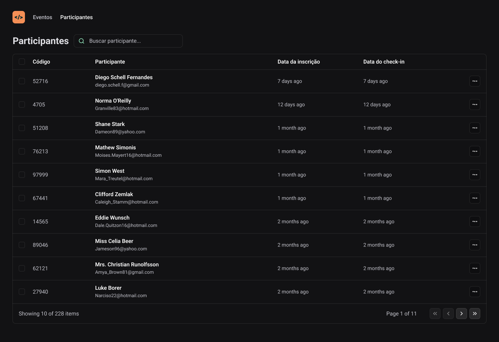

  <a href="#-tecnologias">Tecnologias</a>&nbsp;&nbsp;&nbsp;|&nbsp;&nbsp;&nbsp;
  <a href="#-projeto">Projeto</a>&nbsp;&nbsp;&nbsp;|&nbsp;&nbsp;&nbsp;
  <a href="#memo-licença">Licença</a>

  

 

  

## 🚀 Tecnologias 

Esse projeto foi desenvolvido com as seguintes tecnologias:

- React
- Vite
- TypeScript
- Tailwind

## Projeto

Desenvolvimento de uma aplicação front-end em ReactJS, aplicação dos conceitos de Propriedades, Estados e Componentes, tipagem com Typescript, tooling com Vite, interface responsiva com TailwindCSS, consumo de API Node.js, uso de URL states.

### ReactJS   

O ReactJS é uma biblioteca JavaScript para construir interfaces de usuário. Ele utiliza um paradigma baseado em componentes, que permite criar interfaces reutilizáveis e modulares. Neste projeto, o ReactJS é usado para construir a estrutura da aplicação e gerenciar o estado dos componentes.

### Typescript   

O Typescript é uma linguagem de tipagem superconjunto do JavaScript. Ele adiciona tipagem estática ao código JavaScript, o que garante a segurança e confiabilidade do código. Neste projeto, o Typescript é usado para tipar as propriedades, estados e funções dos componentes ReactJS.

### Vite  

O Vite é uma ferramenta de desenvolvimento moderna para projetos JavaScript. Ele oferece inicialização rápida, recarregamento instantâneo e suporte nativo para hot reloading. Neste projeto, o Vite é usado para iniciar e desenvolver a aplicação ReactJS.

### TailwindCSS       

O TailwindCSS é um framework CSS que oferece classes pré-construídas para estilizar rapidamente elementos HTML. Ele permite criar interfaces responsivas e personalizáveis com facilidade. Neste projeto, o TailwindCSS é usado para estilizar a interface da aplicação ReactJS.

### API Node.js   

A API Node.js é uma API RESTful desenvolvida em Node.js para comunicação com o back-end. Ela fornece endpoints para acessar e manipular dados da aplicação. Neste projeto, a API Node.js é usada para buscar e enviar dados para a aplicação ReactJS.

### URL States ⚙️

Os URL states são um mecanismo para armazenar dados no histórico do navegador. Eles permitem que os usuários naveguem entre diferentes estados da aplicação sem perder dados. Neste projeto, os URL states são usados para armazenar o estado atual da aplicação e restaurá-lo quando o usuário retorna a uma página anterior.

## Instalação e Execução

Para rodar este projeto localmente, siga os passos abaixo:

1. **Clonar o repositório:**
    
    HTTPS: `https://github.com/mateusmoraes6/pass-in-web.git`
   
    GitHUB CLI: `gh repo clone mateusmoraes6/pass-in-web`
    
3. **Instalar as dependências:**
    
    `cd pass-in-web npm install`
    
4. **Rodar a aplicação:**
    
    `npm start` ou `npm run dev`

Isso iniciará a aplicação em modo de desenvolvimento. Abra http://localhost:3000 no navegador para visualizar o projeto.

## Contribuição

Este projeto está aberto para contribuições. Sinta-se à vontade para criar issues, propor melhorias e enviar pull requests.
